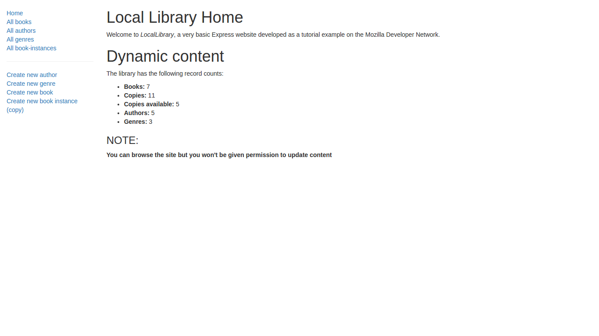

# Node-practice
A few basic node apps... 
Most of the code is from [MDN tutorial](https://developer.mozilla.org/en-US/docs/Learn/Server-side/Express_Nodejs)  

Also tried deploying the library website and is hosted at https://explibrary.herokuapp.com/  
Note that the deployed site is different from code and doesn't have update/delete access.  
The database used is MangoDB and is hosted at [mLab](https://mlab.com/)
  
   

